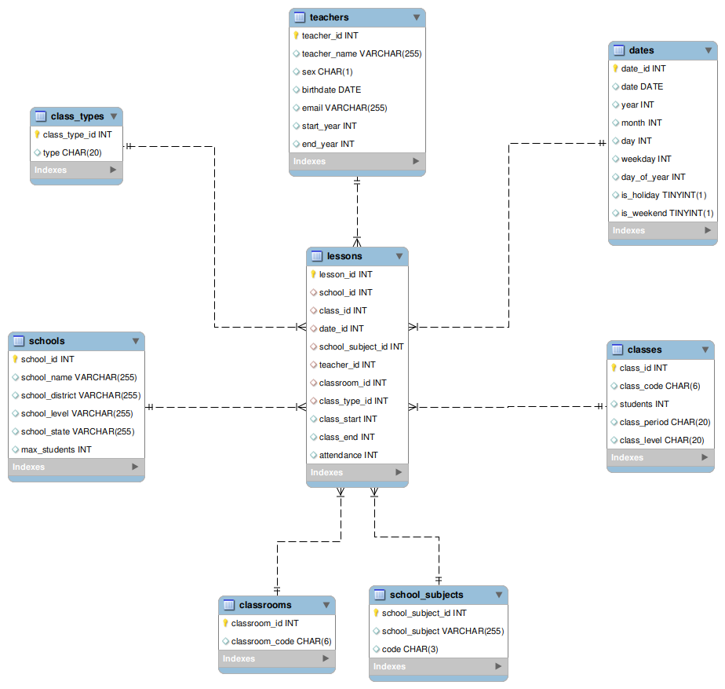

## Especialização em Engenharia e Adm. de Sistemas de Banco de dados 
### Projeto Final - CET 0604 - Programação e Otimização em SQL
### Integrantes do grupo:

- José Cabadas
- Gabriel Sari
- Mirray Teixeira
- André Martins

Este trabalho tem como intuito a implementação de uma estrutura de dados tomando como referência o esquema/modelo fato dimensão, também conhecido na literatura como esquema estrela, sendo que após a implementação da estrutura de dados, será feito análise técnica sobre as particularidades da estrutura de dados, análise e justificativa sobre as escolhas de campos, e queries que refletem em otimizações (tipos de dados, escrita de consultas, índices etc.), assim como demonstrações dos respectivos resultados obtidos. A base de dados a ser implementada e analisada seguirá o contexto escolar, com foco no armazenamento de aulas, sendo que o sistema gerenciador de banco de dados escolhido para a respectiva implementação será o MySQL.
O modelo fato dimensão ou esquema estrela, idealizado por Ralph Kimball, é composto no centro por uma tabela fato, rodeada por tabelas de dimensão. A tabela fato é uma tabela com uma quantidade enorme de linhas, e que representa os fatos relacionados a um contexto, que podem se repetir ou não. A tabela dimensão é a tabela que vai auxiliar a tabela fato com dados complementares ou explicativos, e que possui informações que não se repetem. O relacionamento entre ambas as tabelas se dá através de chaves estrangeiras, portanto a tabela fato armazena as chaves primárias das tabelas dimensões, estabelecendo assim um relacionamento com elas. Segue abaixo ilustração de uma tabela fato com suas respectivas dimensões:
 
 

1.  Contexto

Nossa equipe foi contratada por um grupo de escolas norte-americano chamado **Tetrahedron** para um projeto de consultoria. A principais queixas trazidas por eles estão relacionadas a problemas de funcionamento de um programa de uso interno pela coordenação, cuja principal função é realizar o controle de aulas de todas as escolas de grupo. O Tetrahedron Group já existe há mais de 20 anos e tem um total de 100 escolas espalhadas por vários estados norte-americanos. Com o tempo, a coordenação vem notando uma degradação visível no funcionamento desse programa de controle e precisa de nossa ajuda para melhor a experiência dos seus funcionários, que hoje perdem muito tempo para executar algumas tarefas. Como esse programa utiliza um banco de dados local, nossa equipe foi chamada para encontrar oportunidades de otimização e executar melhorias com foco em performance e redução de custos.

2.  Criação da Base de Dados

[Link para download da base de dados fictícia](https://drive.google.com/drive/folders/1zKqD3gytX3L3PK4yJTSkAVFXYs93zYui). 
Aproximadamente 25 milhões de linhas, com tamanho original 1gb e tamanho comprimido 250mb.

Para criar a base de dados fictícia, partimos da tabela fato **Aulas** (*lessons*) e construímos as seguintes dimensões associadas: **Datas** (*dates*),  **Escolas** (*schools*),  **Disciplinas** (*school_subjects*),  **Professores** (*teachers*),  **Tipos de aula** (*class_types*),  **Salas de aula** (*classrooms*) e **Turmas** (*classes*). 

O script [`2_1_create_schema.sql`](schools/scripts/2_1_create_schema.sql) contém os comandos de criação das tabelas e a seguir mostramos a representação da modelagem e damos uma breve descrição do que cada coluna representa:

    Tabela class_types
    - class_type_id (int): Chave primária. Exemplo de valores: {1, 2, 3, 4, ...}
    - type (char (20)): Tipo de aula (ONLINE, IN PERSON)

    Tabela classes
    - class_code (char (6)): Código no formato abc123, xyz345 usado para identificação da turma
    - class_id (int): Chave primária. Exemplo de valores: {1, 2, 3, 4, ...}
    - class_level (char (20)): Nível da aula (Elementary, Middle, High)
    - class_period (char (20)): Horário da aula (Morning, Afternoon, Evening)
    - students (int): Número de alunos. Exemplo de valores: {11, 23, 30, 45, ...}

    Tabela classrooms
    - classroom_code (char (6)): Código no formato abc123, xyz345 usado para identificação da sala
    - classroom_id (int): Chave primária. Exemplo de valores: {1, 2, 3, 4, ...}

    Tabela dates
    - date (date): Data. Exemplo de valores: {‘2010-06-01’, ‘2020-05-27’}
    - date_id (int): Chave primária. Exemplo de valores: {1, 2, 3, 4, ...}
    - day (int): Dia (1-31)
    - day_of_year (int): Ordem do dia no ano (1-366)
    - is_holiday (tinyint): Dia é feriado (0, 1)
    - is_weekend (tinyint): Dia é fim-de-semana (0, 1)
    - month (int): Ordem do mês no ano (1-12)
    - weekday (int): Ordem nos dias da semana (0-6)
    - year (int): Ano. Exemplo de valores: {2010, 2020}

    Tabela lessons
    - attendance (int): Alunos presentes na aula. Exemplo de valores: {22, 31, 43, ...}
    - class_end (int): Hora final da aula. Exemplo de valores: {9, 10, 11, ...}
    - class_id (int): Chave estrangeira da turma. Exemplo de valores: {1, 2, 3, 4, ...}
    - class_start (int): Hora de início da aula. Exemplo de valores: {8, 9, 10, ...}
    - class_type_id (int): Chave estrangeira do tipo de aula. Exemplo de valores: {1, 2, 3, 4, ...}
    - classroom_id (int): Chave estrangeira da sala de aula. Exemplo de valores: {1, 2, 3, 4, ...}
    - date_id (int): Chave estrangeira da data da aula. Exemplo de valores: {1, 2, 3, 4, ...}
    - lesson_id (int): Chave primária. Exemplo de valores: {1, 2, 3, 4, ...}
    - school_id (int): Chave estrangeira da escola. Exemplo de valores: {1, 2, 3, 4, ...}
    - school_subject_id (int): Chave estrangeira da disciplina. Exemplo de valores: {1, 2, 3, 4, ...}
    - teacher_id (int): Chave estrangeira do professor. Exemplo de valores: {1, 2, 3, 4, ...}

    Tabela school_subjects
    - code (char (3)): Abreviação Exemplo de valores: SCI, para Science
    - school_subject (varchar (255)): Nome da disciplina Exemplo de valores: Math, Science, History
    - school_subject_id (int): Chave primária. Exemplo de valores: {11, 23, 30, 45, ...}

    Tabela schools
    - max_students (int): Capacidade máxima de estudantes. Exemplo de valores: {500, 1000}
    - school_district (varchar (255)): Distrito da escola. Exemplo de valores: {Pittsburgh, Los Angeles}
    - school_id (int): Chave primária. Exemplo de valores: {11, 23, 30, 45, ...}
    - school_level (varchar (255)): Grau da escola (Elementary, Middle, High)
    - school_name (varchar (255)): Nome da escola. Exemplo de valores: {Altamont, Valencia}
    - school_state (varchar (255)): Estado da escola. Exemplo de valores: {CA, NC}

    Tabela teachers
    - birthdate (date): Data de nascimento. Exemplo de valores: {‘1987-06-01’, ‘1990-05-27’}
    - email (varchar (255)): E-mail. Exemplo de valores: {mbarros@uol.com.br, taraujo@hotmail.com}
    - end_year (int): Ano que parou de lecionar. Exemplo de valores: {2019, 2021}
    - sex (char (1)): Sexo (M, F)
    - start_year (int): Ano que começou a lecionar. Exemplo de valores: {2015, 2020}
    - teacher_id (int): Chave primária. Exemplo de valores: {11, 23, 30, 45, ...}
    - teacher_name (varchar (255)): Nome do professor. Exemplo de valores: {Bruno Porto, Maysa Moura}

Os detalhes de como os dados fictícios de cada tabela foram gerados podem ser encontrados no notebook [`2_2_populate_db.ipynb`](schools/notebooks/2_2_populate_db.ipynb). Tentamos ser realistas na geração dos dados (por exemplo, escolas do nível Elementary só possuem turmas Elementary, turmas da manhã só têm aulas das 8h até 12h, etc), mas como o foco do projeto é a otimização, optamos por manter algumas inconsistências (por exemplo, professores podem dar mais de uma aula mesmo tempo).

Assumimos que esse é o estado no qual a nossa equipe recebeu a base de dados para executar o projeto.

3.  Oportunidades de Otimização

    3.1 **Correção de tipos de colunas**: Identificamos que algumas colunas estão definidas com o tipo ideal para o dado que estão armazenando. Sendo assim, propusemos que inicialmente sejam feitas alterações para os tipos de certas colunas, sendo elas:
    
        Tabela dates
        - date_id UNSIGNED INT
        - year UNSIGNED SMALLINT
        - month UNSIGNED TINYINT
        - day UNSIGNED TINYINT
        - weekday UNSIGNED TINYINT
        - day_of_year UNSIGNED TINYINT
        - is_holiday UNSIGNED TINYINT(1)
        - is_weekend UNSIGNED TINYINT(1)

        Tabela schools
        - school_id UNSIGNED INT
        - school_name CHAR(50)
        - school_district CHAR(30)
        - school_level CHAR(20)
        - school_state CHAR(2)
        - max_students UNSIGNED INT

        Tabela school_subjects
        - school_subject_id UNSIGNED INT
        - school_subject CHAR(30)

        Tabela classrooms
        - classroom_id UNSIGNED INT

        Tabela class_types
        - class_type_id UNSIGNED INT

        Tabela teachers
        - teacher_id UNSIGNED INT
        - teacher_name CHAR(50)   
        - start_year UNSIGNED SMALLINT
        - end_year UNSIGNED SMALLINT

        Tabela classes
        - class_id UNSIGNED INT
        - students UNSIGNED SMALLINT

        Tabela lessons   
        - lesson_id UNSIGNED INT
        - school_id UNSIGNED INT
        - class_id UNSIGNED INT
        - date_id UNSIGNED INT
        - school_subject_id UNSIGNED INT
        - teacher_id UNSIGNED INT
        - classroom_id UNSIGNED INT
        - class_type_id UNSIGNED INT
        - class_start UNSIGNED TINYINT
        - class_end UNSIGNED TINYINT
        - attendance UNSIGNED SMALLINT

    O tipo INT UNSIGNED foi escolhido como tipo de dados para os campos/colunas que são chave primária, sendo que nesse caso não haverá necessidade de uso de valores com sinal (negativos), além que o tipo INT UNSIGNED comporta com folga a demanda de registros a serem armazenados em um ambiente de produção escolar.
    
    O tipo TYNINT UNSIGNED, foi preferido para colunas que vão armazenar valores positivos pequenos, pois não haverá necessidade de armazenar números com sinal, além de que os valores armazenados ficaram na casa de poucas dezenas, ou no máximo em um caso excepcional na casa de centenas.

    O tipo SMALLINT UNSIGNED, foi preferido para colunas que vão armazenar valores positivos medianos, inferiores a 65535, pois os valores armazenados ficaram na casa de poucas dezenas, ou no máximo em um caso excepcional na casa de centenas.

    Para a maioria dos campos que armazenam sequencias de caracteres (strings), com exceção dos campos email, tabela teachers, e school_subject, tabela school_subjects, foi escolhido o tipo CHAR(x) como tipo de dados, sendo especificado entre parâmetros a quantidade de caracteres necessária, sendo que optamos pelo tipo CHAR ao invés do VARCHAR.

    O tipo VARCHAR é usado para guardar strings de tamanho variável e usa alocação dinâmica de memória. O CHAR tem tamanho fixo e tem alocação estática de memória. Normalmente, se o conteúdo é de tamanho fixo (ou muito semelhante) então o uso de CHAR trás melhor performance. Quando o tamanho difere muito então é melhor usar o VARCHAR.

    Normalmente o VARCHAR usa um ou dois bytes de memória adicionais (para tamanho ou para marcar o final dos dados) em relação ao tamanho total dos dados.
    Por exemplo, para armazenar a palavra "Oracle":

    CHAR (6) = 6 bytes, sem overhead
    VARCHAR (10) = 8 bytes usados (2 de overhead)
    CHAR (10) = 10 bytes usados (4 bytes de overhead)

    Em termos de performance temos duas coisas a considerar:

    Com o CHAR, uma vez que o tamanho do campo é definido, o tamanho obtido no final será exatamente aquele que foi definido, sendo que o processamento das strings é mais simples uma vez que o tamanho dos dados é completamente previsível.

    Com o VARCHAR, o processamento é um pouco diferente. Por exemplo, quando é definido uma coluna com o tipo VARCHAR (10) na realidade o SGBD aloca dinamicamente até 11 caracteres (10 + 1 para guardar o tamanho dos dados). O processamento das strings deverá sempre ter que contemplar alguma forma de validação do tamanho dos dados.

    Esta diferença torna-se mais aparente quando pensamos em dois aspectos: 
    - Armazenamento de milhões ou bilhões de registos; 
    - Indexar colunas CHAR ou VARCHAR.
      1. O VARCHAR tem vantagem porque pode em teoria produzir registros mais compactos (de menor tamanho) e consequentemente, menos espaço em disco ocupado.
      2. Uma vez que o CHAR requer menor manipulação dos dados devido ao tamanho fixo, pode ser normalmente até 20% mais rápido a efetuar um lookup no index em comparação com o mesmo campo em VARCHAR. (Isto é válido para MySQL de acordo com o livro MySQL Database Design and Tuning)
      3. Uma outra coisa a se levar em consideração, tem a ver com a fragmentação. Por vezes uma tabela, com ID PK VARCHAR pode ficar fragmentada devido divisão de páginas nas colunas VARCHAR. Por vezes definir a coluna como CHAR pode resolver esse problema.

    
    O script usado para alteração das colunas pode ser visto em [`3_1_alter_columns.sql`](schools/scripts/3_1_alter_columns.sql)

    3.2 **Arquivamento de dados**: Após conversar com a coordenação da escola, entendemos que, apesar do banco de dados armazenar informações de mais de 20 anos, apenas informações dos últimos 10 anos eram necessárias para geração dos relatórios que eles utilizavam no dia-a-dia. Sendo assim, propusemos que as informações relacionadas a aulas do período anterior a esse fossem arquivadas, e dessa forma todas as queries se beneficiariam dessa redução da base. No notebook [`3_2_data_archive.ipynb`](schools/notebooks/3_2_data_archive.ipynb), mostramos o script que foi executado para separar a informação de aulas antigas em uma tabela separada, que posteriormente será exportada e arquivada para diminuir os custos com o banco de dados. Ao final, vemos que conseguimos reduzir a tabela `lessons` para 12.254.240 linhas, exportando um total de 13.370.688 linhas para a tabela arquivada.

    3.3 **Cache**: Uma outra queixa trazida pela coordenação está relacionada ao tempo que o programa leva para iniciar. Segundo eles, toda vez que fechamos e abrimos o programa, eles perdem alguns minutos esperando a inicialização. Nossa equipe investigou o código do programa e viu que, ao ser iniciado, ele executa uma query que mostra a quantidade média de alunos presente de todos os professores por ano (vista no arquivo [`3_3_teachers_performance.sql`](schools/scripts/3_3_teachers_performance.sql). No notebook [`3_3_cache.ipynb`](schools/notebooks/3_3_cache.ipynb) executamos a query e vimos que ela leva cerca de 2 minutos, e provavelmente é o que está atrasando a inicialização do programa. Nossa equipe analisou a query e entendeu que, como as aulas são salvas apenas no fim do dia, só há necessidade de executá-la uma vez por dia. Todas as outras execuções ao longo do dia vão retornar o mesmo resultado. Por conta disso, implementamos um sistema de cache no banco de dados, especificamente para essa query, e garantimos que apenas a primeira execução da query demoraria. Uma outra alternativa seria criar um script de execução diária da query, mas o grupo Tetrahedron preferiu a primeira solução pois essa segunda exigiria horas gastas com nossa consultoria para implementação.
    
    Também fizemos uma avaliação de melhoria da query original que se mostrou promissora. Para a consulta de performance de processor,  foi avaliado o desempenho de duas consultas, a primeira, uma consulta direta, sem qualquer otimização.
    
     ` SELECT l.teacher_id,teacher_name, year, AVG(attendance) AS avg_attendance
         FROM lessons l
         JOIN dates  ON dates.date_id = l.date_id
         join teachers on l.teacher_id = teachers.teacher_id
     GROUP BY l.teacher_id, dates.year, teacher_name
         ORDER BY avg_attendance DESC; `

     A segunda, foi construida usando uma expressão de tabela comum (CTE);

      ` WITH attendances AS (
           SELECT teacher_id, year, AVG(attendance) AS avg_attendance
           FROM lessons
           JOIN dates ON dates.date_id = lessons.date_id
           GROUP BY teacher_id, year
           ORDER BY avg_attendance DESC
       )
       SELECT attendances.teacher_id, teacher_name, attendances.year, attendances.avg_attendance FROM attendances
       join teachers on attendances.teacher_id = teachers.teacher_id; `

      A consulta de Performace de Professores, utilizando uma expressão de tabela comum apresentou o desempenho 4 vezes mais rápido que utilizando a consulta diretamente, como mostrado na consulta abaixo:

      

      Os índices utilizados nessa consulta são os índices de chaves (primárias e estrangeiras) logo não foi necessária a criação ou exclusão dos mesmos.

    3.4 **Índices**: Uma outra análise que nossa equipe fez foi com relação aos índices presentes na tabela de fatos. No notebook [`3_4_create_index.ipynb`](schools/notebooks/3_4_create_index.ipynb), vemos que a tabela `lessons` possui indíces para todas as colunas que referenciam ids de tabelas de dimensões. Isso acontece porque o [MySQL cria automaticamente índices para colunas com chaves estrangeiras](https://dev.mysql.com/doc/refman/8.0/en/constraint-foreign-key.html#:~:text=MySQL%20requires%20that%20foreign%20key,column%2C%20an%20index%20is%20created.&text=Information%20about%20foreign%20keys%20on,tables%2C%20in%20the%20INFORMATION_SCHEMA%20database.). A única coluna que não possui um índice associado é a de `attendance`, porém não encontramos nenhuma query onde a criação do indíce melhoraria a sua performance. Isso aconteceria, por exemplo, se houvessem queries onde a coluna estivesse sendo usada numa cláusula `WHERE`, porém não foi o caso.
